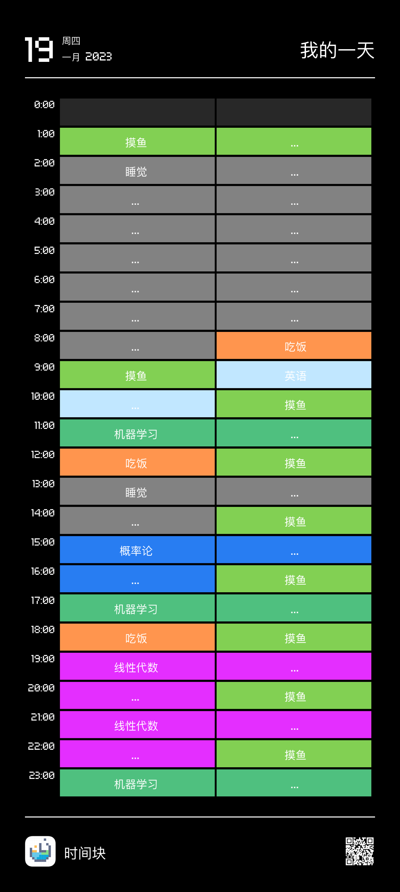

# 1月18日寄

今天不写太多。

首先恭喜自己过了很长时间以来最自律的一天。早晨8:30起床，高质量的完成了6篇艺术类托福听力。我原本安排是两小时一口气做，但是这样会导致疲劳，所以我做了一半就趴着打了个盹，起来继续干活。下午听课也听得不错，被点起来发言一次外加举手发言一次，很充实也有收获。晚上完成了规定任务的70%以上，已经很不错了。

此外，和爸妈在餐桌上相谈甚欢，是好事情。今天全家都很在状态！

没太多值得吐槽的地方，因此今天就在此收笔，明天继续保持。

附上明天的大致安排。由于吃饭时间不定，所以会有变化，但是具体任务不变。ML需要刷完2/3个Week的量，线性代数至少要做到6.7节。概率论巩固极限定理的内容。

